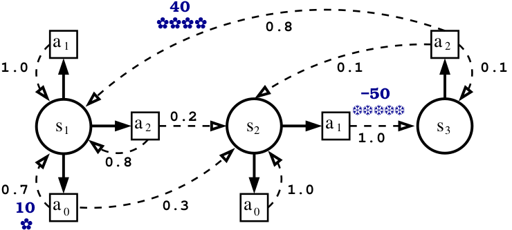

MDP Lesson 2: additional methods
Description
We present here an MDP (Markov Decision Process) model with three states (s1, s2, s3) and three actions (a0, a1, a2). The transition probabilities and rewards are described by the figure below.

|

|

As we can see, the number of actions is not the same in each state. In state s1, any of the actions a0, a1, and a2 can be triggered, whereas in state s3, only action a2 can be triggered.

To simplify programming, we chose to have an identical action space in each state. This means that we can activate all actions a0, a1, a2 in all states. To do this, we add missing actions that will have no effect and will receive a high cost.

In state s3, we add action a0 with a transition to s3 with a probability of 1.
In state s3, we add action a1 with a transition to s3 with a probability of 1.
In state s2, we add action a2 with a transition to s2 with a probability of 1.
With a discount factor of 0.95, the expected optimal policy and value function are those mentioned in the original RST file.

Tasks performed
#. Creation of the MDP

   * Creation of two ``MarmoteInterval`` objects to contain the state space and the action space
   * Creation of three ``SparseMatrix`` transition matrices associated with each of the three actions
   * Creation of three ``SparseMatrix`` reward matrices for each action
   * Creation of the discounted MDP ``DiscountedMDP``
#. Solving the MDP with the ValueIteration method
#. Creation of a Markov chain associated with the optimal policy
#. Generation of Q-values for reinforcement learning
#. Use of EpsilonGreedy and SoftMax strategies for action selection

Code
Here is the creation of the state and action spaces:

.. code-block:: c++

   MarmoteSet *actionSpace = new MarmoteInterval(0,2);
   MarmoteSet *stateSpace = new MarmoteInterval(0,2);

Then, the creation of the transition matrices:

.. code-block:: c++

   vector<TransitionStructure*> trans(actionSpace->Cardinal());
   SparseMatrix *P0 = new SparseMatrix(3); 
   /* matrix for the a0 action*/
   P0->setEntry(0,0,0.7);
   P0->setEntry(0,1,0.3);
   P0->setEntry(1,1,1.0);
   P0->setEntry(2,2,1.0); /* add virtual action */
   trans.at(0) = P0;

   /* matrix for the a1 action*/
   SparseMatrix *P1 = new SparseMatrix(3);
   P1->setEntry(0,0,1.0);
   P1->setEntry(1,2,1.0);
   P1->setEntry(2,2,1.0); /* add virtual action */
   trans.at(1) = P1;

   /* matrix for the a2 action*/
   SparseMatrix *P2 = new SparseMatrix(3);
   P2->setEntry(0,0,0.8);
   P2->setEntry(0,1,0.2);
   P2->setEntry(1,1,1.0); /* add virtual action */
   P2->setEntry(2,0,0.8);
   P2->setEntry(2,1,0.1);
   P2->setEntry(2,2,0.1);
   trans.at(2) = P2;

Creation of reward matrices for each action:

.. code-block:: c++

   double penalty = -100000; 
   vector<TransitionStructure*> rews(actionSpace->Cardinal());

   SparseMatrix *R1 = new SparseMatrix(3);
   SparseMatrix *R2 = new SparseMatrix(3);
   SparseMatrix *R3 = new SparseMatrix(3);

   R1->setEntry(0,0,10);
   R1->setEntry(2,2,penalty);

   R2->setEntry(1,2,-50);
   R2->setEntry(2,2,penalty);

   R3->setEntry(1,1,penalty);
   R3->setEntry(2,0,40);

   /* Adding reward to collection */
   rews.at(0) = R1;
   rews.at(1) = R2;
   rews.at(2) = R3;

Definition of parameters and creation of the MDP:

.. code-block:: c++

   double beta = 0.95;
   string critere("max");

   DiscountedMDP *mdp = new DiscountedMDP(critere, stateSpace, actionSpace, trans, rews, beta);

Solving the MDP with Value Iteration:

.. code-block:: c++

   double epsilon = 0.00001;
   int maxIter = 150;

   FeedbackSolutionMDP *optimum = mdp->ValueIteration(epsilon, maxIter);
   optimum->Write();

Generation of the Markov chain from the optimal policy:

.. code-block:: c++

   TransitionStructure *Mat = mdp->GetChain(optimum);
   Mat->set_type(DISCRETE);
   cout << *Mat << endl;

   // Creation of the initial distribution
   double initial_prob[3] = {0.333, 0.333, 0.334};
   int states[3] = {0, 1, 2};
   DiscreteDistribution *initial = new DiscreteDistribution(states, initial_prob, 3);

   // Creation of the Markov chain
   MarkovChain *chain = new MarkovChain(Mat);
   chain->set_init_distribution(initial);
   chain->set_model_name("Chain issued from the MDP");

   cout << *chain << endl;

Generation of Q-values for reinforcement learning:

.. code-block:: c++

   FeedbackQvalueMDP *F = mdp->GetQValue(optimum);
   cout << *F << endl;

   // For action sampling, reset the random generator
   F->ResetSeed();

   // Sample an action using EpsilonGreedy in state 0
   int action = F->EpsilonGreedyMax(0, 0.1);
   cout << "Action with EpsilonGreedy: " << action << endl;

   // Sample an action using SoftMax in state 2
   action = F->SoftMax(2);
   cout << "Action with SoftMax: " << action << endl;

Download
--------

The source file can be downloaded :download:`here <../media/exampleMDP11.cpp>`.

Output
------

.. literalinclude:: ../media/exampleMDP11.res
    :language: text