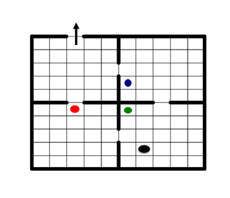

Example MDP 31 : Total Reward MDP with two-dimensional state space
==================================================================

Description
-----------

In this example, we model the famous Stochastic Shortest Path: **four rooms** using C++. A detailed presentation can be seen in the chapter *Hierarchical reinforcement learning* by Hengst in the book *Reinforcement Learning State of the Art* edited by M. Wiering and M. van Otterlo.

The MDP can be represented by

Mathematical Description
~~~~~~~~~~~~~~~~~~~~~~~~

We add a supplementary line. Once we reach any element of line 10, we infinitely remain in this state.

Hence:

* The state space is a box of eleven lines and ten columns (*[0,10]x[0,9]*).
* The action space is of size four (0 means UP, 1 means DOWN, 2 means LEFT, 3 means RIGHT).
* Any move costs 1 except the move from state (9,2) to (10,2) that costs -1. Any move in states (10,.) costs 0.
* In each state, we have a probability of 0.9 to follow the action and 0.1 to remain in the same state.

Specificity
~~~~~~~~~~~

A **major advantage** of this example lies in the fact that we have a **multi-dimensional state space** that we manage with **dedicated objects of marmoteCore**, here we use a **MarmoteBox**.

Tasks Performed:
----------------

Multidimensional Sets
~~~~~~~~~~~~~~~~~~~~~

We use a two-dimensional set **MarmoteBox**, which is an inherited class of `MarmoteSet`. It allows managing multidimensional sets and getting the index of any state.

Code
----

1. We build a state space with a `MarmoteBox` object. This requires building an array with the size of each dimension and then building the object with two parameters: the dimension and the array of sizes.

.. code-block:: cpp

    #include <iostream>
    #include "marmotecore.h"
    #include "marmotemdps.h"

    int main() {
        /* Create the state space as a MarmoteBox */
        /* Definitions of the size of the two dimensions: dimension 1 is 11 and dimension 2 is 10 */
        stateType dims[2] = {11, 10};
        /* Create the box */
        MarmoteBox *stateSpace = new MarmoteBox(2, dims);

        /* Create the action space as an interval from 0 to 3 */
        MarmoteInterval *actionSpace = new MarmoteInterval(0, 3);

2. To handle `MarmoteBox`, one should use a *buffer*. This is detailed below.

.. code-block:: cpp

    /* Allocate buffers (to be used to manage the state) */
    MarmoteState statebufferO = stateSpace->StateBuffer();

    /* Defining the state to (9,2) */
    statebufferO[0] = 9;
    statebufferO[1] = 2;
    /* Getting the index of the state (9,2) */
    stateType indexO = stateSpace->Index(statebufferO);
    /* Defining the entry of the cost matrix with action UP to -1 */
    FullMatrix *CostMat = new FullMatrix(stateSpace->Cardinal(), actionSpace->Cardinal());
    CostMat->setEntry(indexO, 0, -1.0);

3. We write the solution with respect to a given dimension. In the code below, dimension 1 varies for each value of dimension 0. This gives a line-by-line writing. To do that, we should cast the type of the policy returned by value iteration to have a `FeedbackSolutionMDP`. Then we write the policy with respect to a given dimension with `WriteSolutionByDim`.

.. code-block:: cpp

    /* Create and fill the cost matrix */
    for (stateType k = 0; k < stateSpace->Cardinal(); ++k) {
        for (stateType a = 0; a < actionSpace->Cardinal(); ++a) {
            CostMat->setEntry(k, a, 1);
        }
    }

    /* Create the MDP */
    TotalRewardMDP *mdpSSP = new TotalRewardMDP("min", stateSpace, actionSpace, CostMat);

    /* Solve the MDP using value iteration */
    double epsilon = 0.0001;
    int maxIter = 250;
    SolutionMDP *optimum2 = mdpSSP->ValueIteration(epsilon, maxIter);

    /* To get FeedbackPolicy properties, we should make a cast */
    FeedbackSolutionMDP *policy = dynamic_cast<FeedbackSolutionMDP*>(optimum2);
    if (policy != nullptr) {
        std::cout << "Print solution by dimension (line by line)" << std::endl;
        policy->WriteSolutionByDim(1, stateSpace);
    }

4. We traverse the whole state space with the methods `stateSpace->FirstState()`.

.. code-block:: cpp

    /* statebufferO is in initial state */
    stateSpace->FirstState(statebufferO);
    /* Traverse */
    for (stateType k = 0; k < stateSpace->Cardinal(); ++k) {
        /* Getting the index of the state */
        stateType indexO = stateSpace->Index(statebufferO);
        /* The different values of the states are in the array statebufferO */
        stateType l = statebufferO[0]; /* Getting value of the first dimension of the box */
        stateType c = statebufferO[1]; /* Getting value of the second dimension of the box */
        /* Writing the row and the column */
        std::cout << "--line=" << l << " --column=" << c;
        /* Getting the values and the action at the index of the state */
        std::cout << " --Optimal action=" << policy->getActionIndex(indexO)
                  << " --Optimal Value=" << policy->getValueIndex(indexO) << std::endl;
        /* Move to next state */
        stateSpace->NextState(statebufferO);
    }

    /* Clean up */
    delete stateSpace;
    delete actionSpace;
    delete CostMat;
    delete mdpSSP;
    delete optimum2;

    return 0;
    }

Download
--------

The source file is :download:`here <../media/exampleMDP31.cpp>`

Output
------

A (partial) output is here

.. literalinclude:: ../media/exampleMDP31.res
    :language: text
